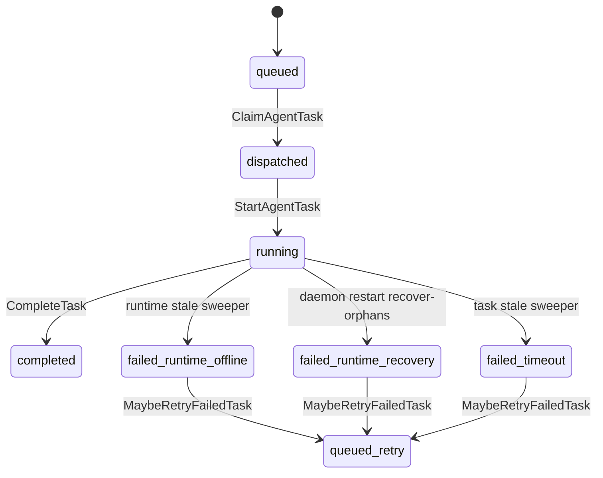
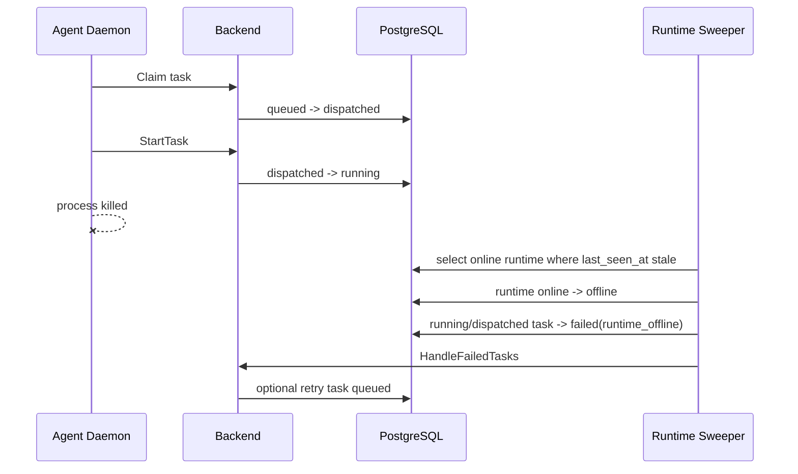
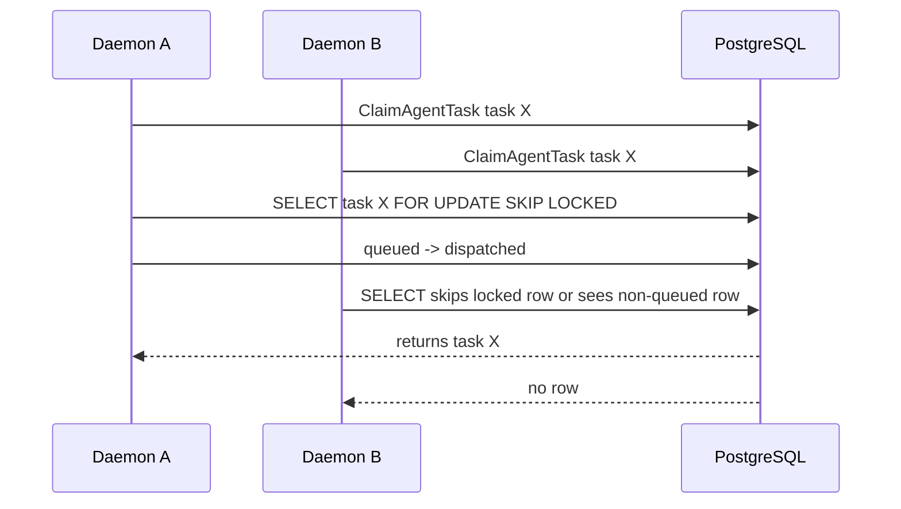
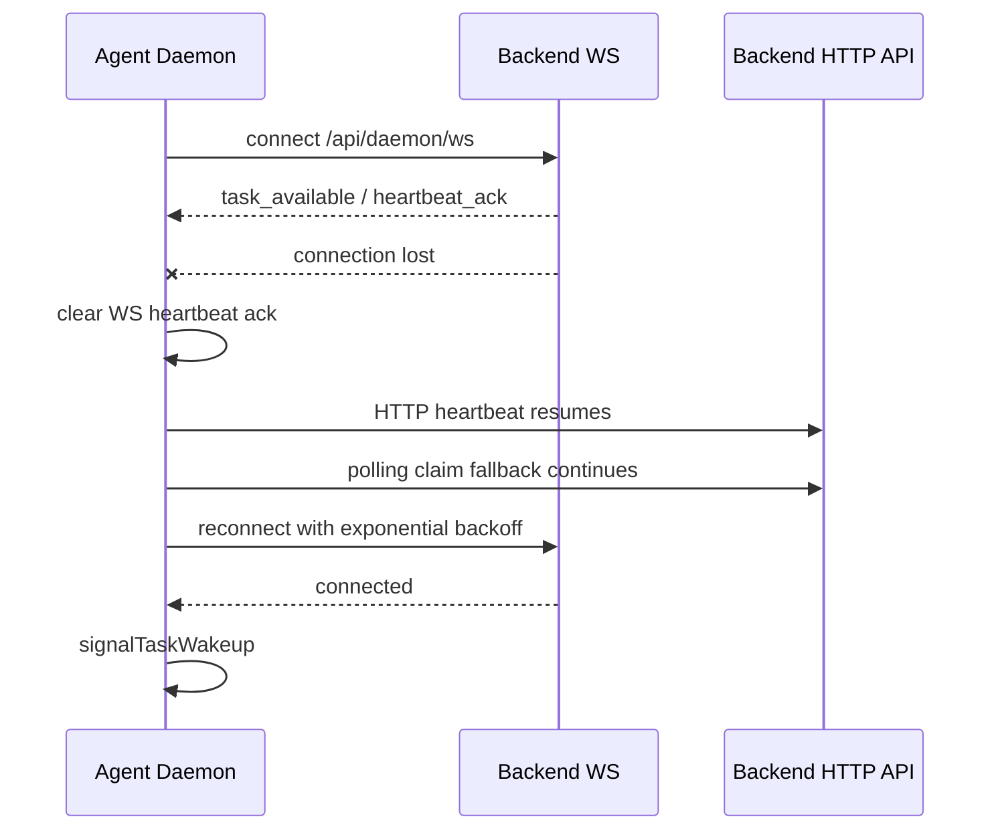
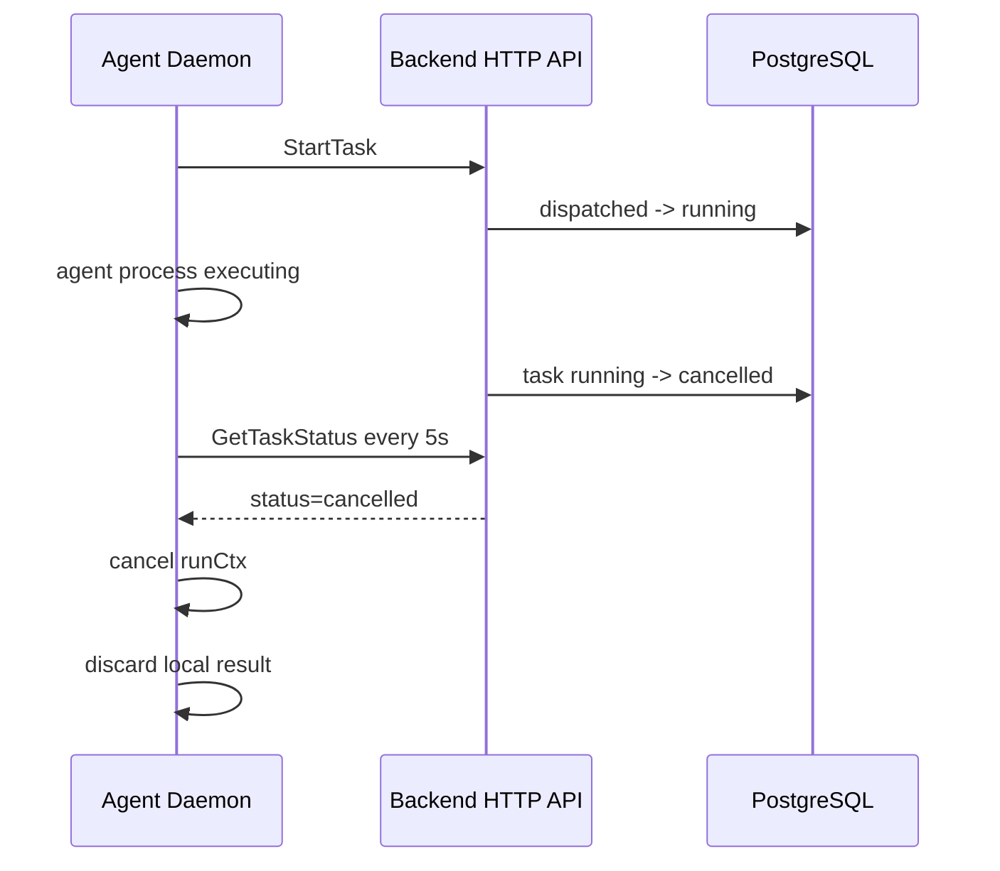
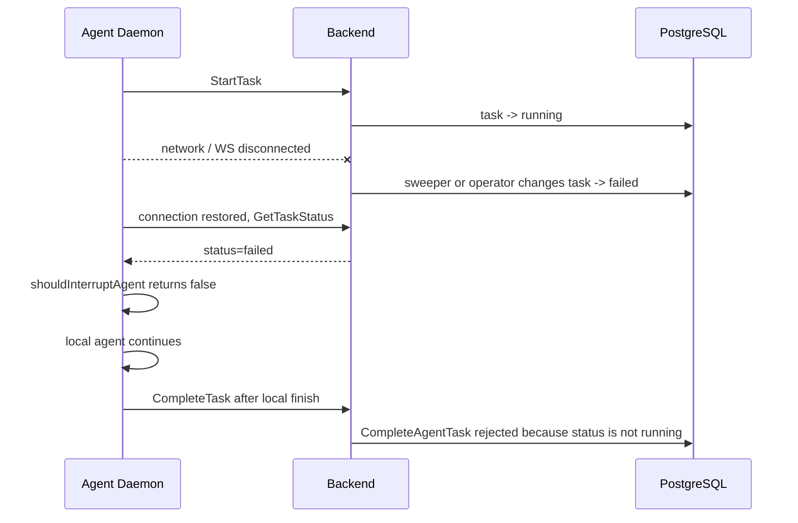

# Agent Daemon 任务一致性场景分析

## 场景 A：Agent Daemon 执行中被 kill

### 代码追踪路径

1. Daemon WebSocket 断开只影响连接索引，不直接标记 runtime 离线。
   - `server/internal/daemonws/hub.go:287`：`Hub.unregister`
   - `server/internal/daemonws/hub.go:317`：`client.readPump`
   - `server/internal/daemonws/hub.go:357`：`handleHeartbeatFrame`

2. Runtime 存活由 heartbeat 维护。
   - `server/internal/handler/daemon.go:612`：`runtimeLivenessTTL = 90s`
   - `server/internal/handler/daemon.go:626`：`runtimeHeartbeatDBFlushInterval = 60s`
   - `server/internal/handler/daemon.go:795`：`recordHeartbeat`
   - `server/internal/handler/daemon.go:848`：`processHeartbeat`

3. 后端 sweeper 周期检测 stale runtime 并清理任务。
   - `server/cmd/server/main.go:319`：启动 `runRuntimeSweeper`
   - `server/cmd/server/runtime_sweeper.go:18`：sweeper 常量
   - `server/cmd/server/runtime_sweeper.go:72`：`runRuntimeSweeper`
   - `server/cmd/server/runtime_sweeper.go:91`：`sweepStaleRuntimes`
   - `server/cmd/server/runtime_sweeper.go:149`：offline runtime 下的 active task 失败处理
   - `server/cmd/server/runtime_sweeper.go:237`：`sweepStaleTasks`

4. 数据库状态变更点。
   - `server/pkg/db/queries/runtime.sql:117`：`SelectStaleOnlineRuntimes`
   - `server/pkg/db/queries/runtime.sql:125`：`MarkRuntimesOfflineByIDs`
   - `server/pkg/db/queries/runtime.sql:144`：`FailTasksForOfflineRuntimes`
   - `server/pkg/db/queries/agent.sql:446`：`RecoverOrphanedTasksForRuntime`
   - `server/pkg/db/queries/agent.sql:462`：`FailStaleTasks`

5. 失败后统一后处理。
   - `server/internal/service/task.go:1442`：`retryableReasons`
   - `server/internal/service/task.go:1470`：`MaybeRetryFailedTask`
   - `server/internal/service/task.go:1652`：`HandleFailedTasks`

### 状态图



### 事件时序



### 结论

不存在“正常代码路径下永久卡在 `running`”的问题。

判断依据：

- Runtime stale threshold 是 150 秒，sweeper 每 30 秒执行一次，所以 daemon 被 kill 后 runtime 离线感知通常有约 180 秒上界。
- `FailTasksForOfflineRuntimes` 会把 offline runtime 下的 `dispatched`、`running`、`waiting_local_directory` 改成 `failed`，失败原因是 `runtime_offline`。
- 如果 runtime 仍被认为在线，`FailStaleTasks` 仍会把超过 9000 秒的 `running` 改成 `failed`，失败原因是 `timeout`。
- daemon 重启时会调用 recover-orphans，把旧进程遗留的 active task 改成 `failed(runtime_recovery)`，比 sweeper 更快。

边界条件：如果后端 sweeper 长期不运行、数据库不可写，或者存在人工写入的异常数据，例如 `status='running'` 但 `started_at IS NULL`，代码机制无法保证自动恢复。这些不属于当前正常代码生成路径。

### 修复方案

当前场景不需要修复。现有机制由三部分保证：

- daemon 重启后的 `recover-orphans`
- runtime 离线后的 `FailTasksForOfflineRuntimes`
- task 超时后的 `FailStaleTasks`

## 场景 B：并发任务分配的竞态条件

### 代码追踪路径

1. Daemon 领取任务入口。
   - `server/cmd/server/router.go:297`：`POST /api/daemon/runtimes/{runtimeId}/tasks/claim`
   - `server/internal/handler/daemon.go:1057`：`ClaimTaskByRuntime`
   - `server/internal/handler/daemon.go:1090`：调用 `TaskService.ClaimTaskForRuntime`

2. Runtime 维度领取。
   - `server/internal/service/task.go:942`：`ClaimTaskForRuntime`
   - `server/pkg/db/queries/agent.sql:567`：`ListQueuedClaimCandidatesByRuntime`
   - `server/internal/service/task.go:1028`：按 candidate 的 `agent_id` 调用 `ClaimTask`

3. Agent 维度领取。
   - `server/internal/service/task.go:870`：`ClaimTask`
   - `server/internal/service/task.go:889`：检查 agent 并发上限
   - `server/internal/service/task.go:902`：调用 `ClaimAgentTask`

4. SQL 原子更新。
   - `server/pkg/db/queries/agent.sql:266`：`ClaimAgentTask`
   - `server/pkg/db/queries/agent.sql:276`：`UPDATE agent_task_queue SET status='dispatched'`
   - `server/pkg/db/queries/agent.sql:300`：`FOR UPDATE SKIP LOCKED`

5. 已派发但响应丢失的恢复。
   - `server/internal/service/task.go:85`：`claimResponseRecoveryWindow = 90s`
   - `server/pkg/db/queries/agent.sql:304`：`ReclaimStaleDispatchedTaskForRuntime`

### 并发时序



### 结论

同一个 task 被两个 Agent 同时分配的问题在当前正常领取路径下不存在。

判断依据：

- `ClaimAgentTask` 是单条 SQL 原子更新，不是先查再改的 Go 层两步操作。
- 子查询使用 `FOR UPDATE SKIP LOCKED`，并且只选择 `status='queued'` 的 row。
- 一旦第一个请求把 task 改成 `dispatched`，第二个请求不能再从 `queued` 集合中选中同一个 row。

### 需要注意的邻近风险

虽然不会双分配同一个 task，但当前 `ClaimTaskForRuntime` 先按 `runtime_id` 列候选，再调用只按 `agent_id` 领取的 `ClaimTask`。如果同一个 agent 在多个 runtime 上存在 queued task，理论上 runtime A 的 poller 可能把 runtime B 的 task 改成 `dispatched`，随后因为 `task.RuntimeID != runtimeID` 不返回给 runtime A。这个问题不是“双分配”，但会造成错误 runtime 的 task 被短暂卡在 `dispatched`，直到 `ReclaimStaleDispatchedTaskForRuntime` 或 sweeper 处理。

### 修复方案

核心修复思路：把领取 SQL 的约束从“只按 agent”增强为“agent + runtime”。这样既保留 `FOR UPDATE SKIP LOCKED` 的并发安全，也消除跨 runtime 误领取风险。

关键代码 diff：

```diff
diff --git a/server/pkg/db/queries/agent.sql b/server/pkg/db/queries/agent.sql
@@
--- name: ClaimAgentTask :one
+-- name: ClaimAgentTaskForRuntime :one
 UPDATE agent_task_queue
 SET status = 'dispatched', dispatched_at = now()
 WHERE id = (
     SELECT atq.id FROM agent_task_queue atq
-    WHERE atq.agent_id = $1 AND atq.status = 'queued'
+    WHERE atq.agent_id = @agent_id
+      AND atq.runtime_id = @runtime_id
+      AND atq.status = 'queued'
       AND NOT EXISTS (
           SELECT 1 FROM agent_task_queue active
           WHERE active.agent_id = atq.agent_id
@@
     LIMIT 1
     FOR UPDATE SKIP LOCKED
 )
 RETURNING *;
diff --git a/server/internal/service/task.go b/server/internal/service/task.go
@@
-task, err := s.Queries.ClaimAgentTask(ctx, agentID)
+task, err := s.Queries.ClaimAgentTaskForRuntime(ctx, db.ClaimAgentTaskForRuntimeParams{
+    AgentID:   agentID,
+    RuntimeID: runtimeID,
+})
```

测试证明：

- 并发唯一领取测试：创建一个 runtime、一个 agent、一个 queued task，启动 50 到 100 个 goroutine 同时调用 `ClaimTaskByRuntime`。断言只有一个响应包含该 task ID，其余响应为 `task: null`，数据库中该 task 最终只有一个 `dispatched` 状态。
- 跨 runtime 防御测试：同一 agent 准备 runtime A 和 runtime B 的 queued task，runtime A 请求 claim 时断言不会把 runtime B 的 task 改成 `dispatched`。

## 场景 C：WebSocket 重连后的状态一致性

### 代码追踪路径

1. Daemon 启动后台循环。
   - `server/internal/daemon/daemon.go:610`：启动 `taskWakeupLoop`、`heartbeatLoop`、`pollLoop`

2. WebSocket 重连。
   - `server/internal/daemon/wakeup.go:21`：`taskWakeupLoop`
   - `server/internal/daemon/wakeup.go:35`：调用 `runTaskWakeupConnection`
   - `server/internal/daemon/wakeup.go:43`：WS 不可用时保留 polling fallback
   - `server/internal/daemon/wakeup.go:47`：带 jitter 的重连等待
   - `server/internal/daemon/wakeup.go:71`：创建 WS URL 并拨号
   - `server/internal/daemon/wakeup.go:97`：WS 断开后清理 WS heartbeat ack，使 HTTP heartbeat 恢复
   - `server/internal/daemon/wakeup.go:101`：连接成功后触发一次 `signalTaskWakeup`

3. WebSocket 消息处理。
   - `server/internal/daemon/wakeup.go:183`：WS heartbeat sender
   - `server/internal/daemon/wakeup.go:246`：`handleWSHeartbeatAck`
   - `server/internal/daemon/wakeup.go:258`：`readTaskWakeupMessages`

4. Polling fallback。
   - `server/internal/daemon/daemon.go:1843`：`pollLoop`
   - `server/internal/daemon/daemon.go:1878`：为每个 runtime 启动 poller
   - `server/internal/daemon/daemon.go:1987`：poller 调用 `ClaimTask`

5. 执行中任务状态检测。
   - `server/internal/daemon/daemon.go:2046`：`shouldInterruptAgent`
   - `server/internal/daemon/daemon.go:2073`：`watchTaskCancellation`
   - `server/internal/daemon/daemon.go:2174`：`handleTask` 使用 `watchTaskCancellation`
   - `server/internal/daemon/daemon.go:2220`：完成前最后一次状态检查
   - `server/internal/daemon/client.go:271`：`GetTaskStatus`
   - `server/internal/handler/daemon.go:1897`：后端 `GetTaskStatus`

6. 终态写入限制。
   - `server/pkg/db/queries/agent.sql:351`：`CompleteAgentTask` 只允许 `status='running'`
   - `server/pkg/db/queries/agent.sql:416`：`FailAgentTask`

### 重连时序



### 执行中任务取消时序



### 结论

存在状态一致性问题，但不是“任务取消无法感知”。

明确结论：

- WebSocket 断开后，daemon 会自动重连，且 polling fallback 仍然可领取任务。
- 任务被取消或删除时，daemon 可以通过 HTTP 状态轮询感知并中断本地 agent。
- 问题在于：`shouldInterruptAgent` 当前只把 `cancelled` 和 404 当作中断信号。如果断连期间后端把任务改成 `failed` 或其他终态，本地 agent 不会立即中断，仍可能继续运行到结束。
- 完成前最后一次状态检查也复用同一个 `shouldInterruptAgent`，因此同样漏掉 `failed` 等终态。

具体问题时序：



### 修复方案

修复目标：

- 本地已经领取的 task 只要后端不再处于 active 状态，就立即中断本地 agent。
- WebSocket 重连后主动对账本地 active task，而不是完全等待下一次 5 秒轮询。

关键代码 diff：

```diff
diff --git a/server/internal/daemon/daemon.go b/server/internal/daemon/daemon.go
@@
 type Daemon struct {
@@
     activeTasks   atomic.Int64
+    activeTaskMu      sync.Mutex
+    activeTaskCancels map[string]context.CancelFunc
@@
 }
@@
 func New(cfg Config, logger *slog.Logger) *Daemon {
@@
         activeEnvRoots:            make(map[string]int),
+        activeTaskCancels:         make(map[string]context.CancelFunc),
@@
 }
@@
 func shouldInterruptAgent(status string, err error) bool {
     if err != nil {
         return isTaskNotFoundError(err)
     }
-    return status == "cancelled"
+    switch status {
+    case "", "dispatched", "waiting_local_directory", "running":
+        return false
+    default:
+        return true
+    }
 }
+
+func (d *Daemon) trackActiveTask(taskID string, cancel context.CancelFunc) {
+    d.activeTaskMu.Lock()
+    defer d.activeTaskMu.Unlock()
+    d.activeTaskCancels[taskID] = cancel
+}
+
+func (d *Daemon) untrackActiveTask(taskID string) {
+    d.activeTaskMu.Lock()
+    defer d.activeTaskMu.Unlock()
+    delete(d.activeTaskCancels, taskID)
+}
+
+func (d *Daemon) reconcileActiveTasks(ctx context.Context) {
+    d.activeTaskMu.Lock()
+    snapshot := make(map[string]context.CancelFunc, len(d.activeTaskCancels))
+    for taskID, cancel := range d.activeTaskCancels {
+        snapshot[taskID] = cancel
+    }
+    d.activeTaskMu.Unlock()
+
+    for taskID, cancel := range snapshot {
+        status, err := d.client.GetTaskStatus(ctx, taskID)
+        if shouldInterruptAgent(status, err) {
+            cancel()
+        }
+    }
+}
@@
     runCtx, runCancel := context.WithCancel(ctx)
     defer runCancel()
+    d.trackActiveTask(task.ID, runCancel)
+    defer d.untrackActiveTask(task.ID)
```

```diff
diff --git a/server/internal/daemon/wakeup.go b/server/internal/daemon/wakeup.go
@@
     d.logger.Info("task wakeup websocket connected", "runtimes", len(runtimeIDs))
     signalTaskWakeup(taskWakeups)
+    go d.reconcileActiveTasks(ctx)
```

测试证明：

- `shouldInterruptAgent` 单元测试：新增 `failed`、`completed`、`queued`、未知终态返回 true；保留 `running`、`dispatched`、`waiting_local_directory` 返回 false；保留瞬时 5xx 返回 false。
- `watchTaskCancellation` 测试：新增 status 为 `failed` 时 channel 会关闭。
- `handleTask` 测试：runner 阻塞等待 `runCtx.Done()`，mock `/status` 返回 `failed`，断言 runner 被取消，且不会调用 `CompleteTask`。
- 重连对账测试：注册一个 active task cancel function，mock `GetTaskStatus` 返回 `failed`，调用 `reconcileActiveTasks` 后断言 cancel function 被调用。

