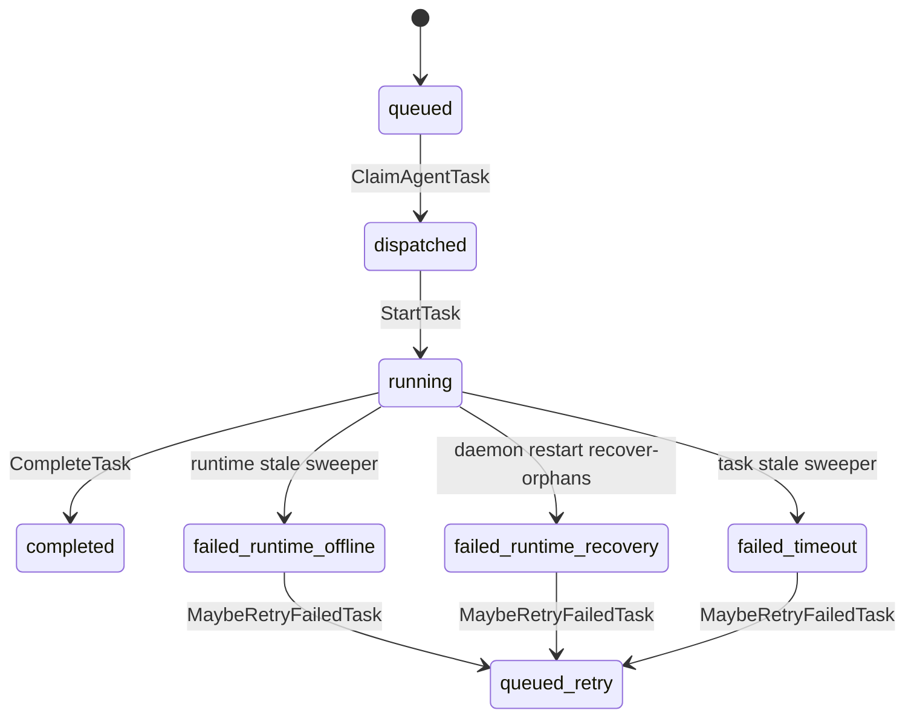
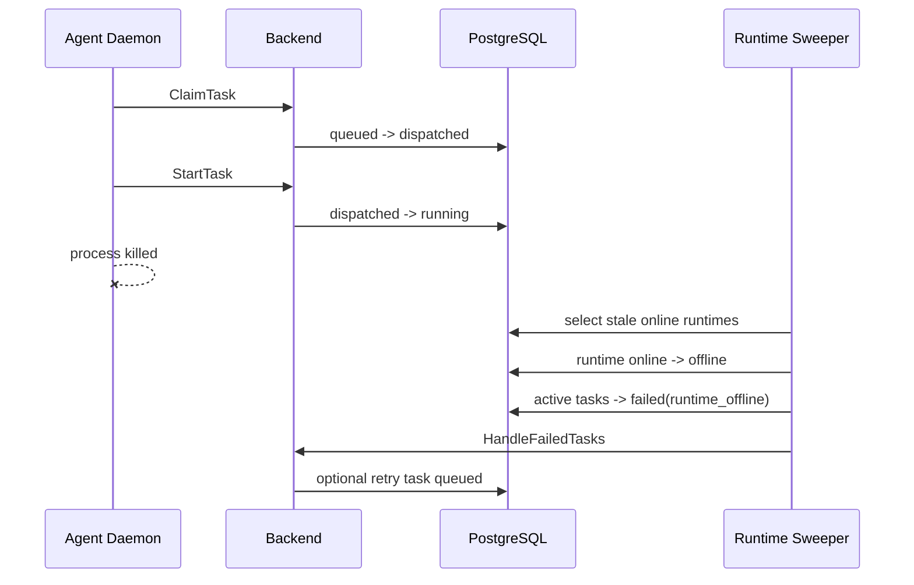
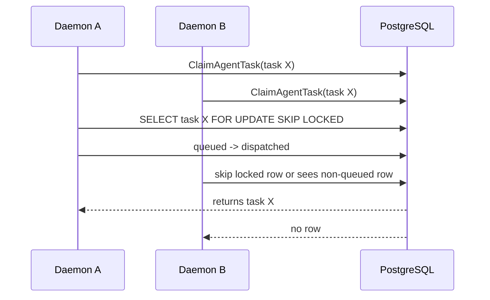
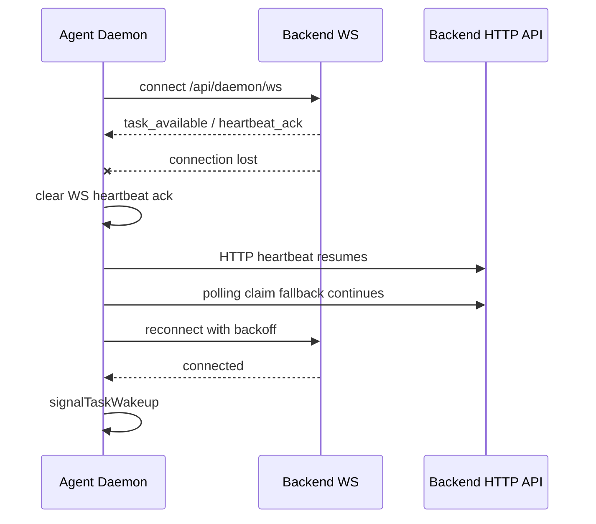
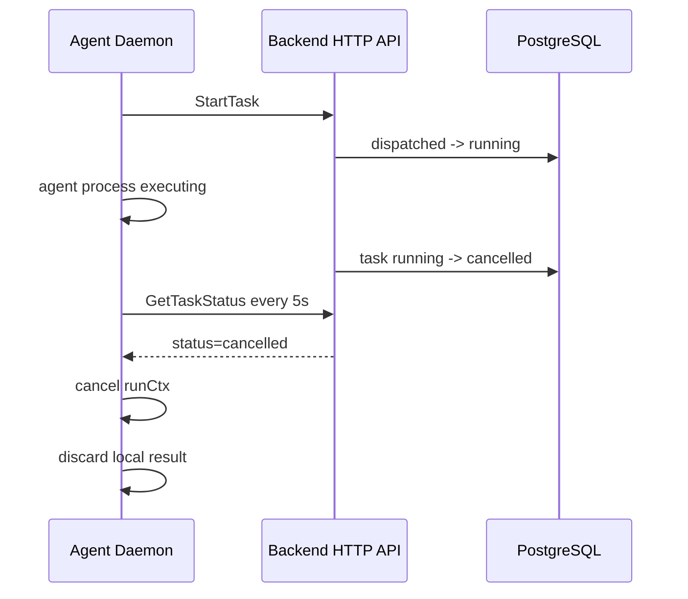
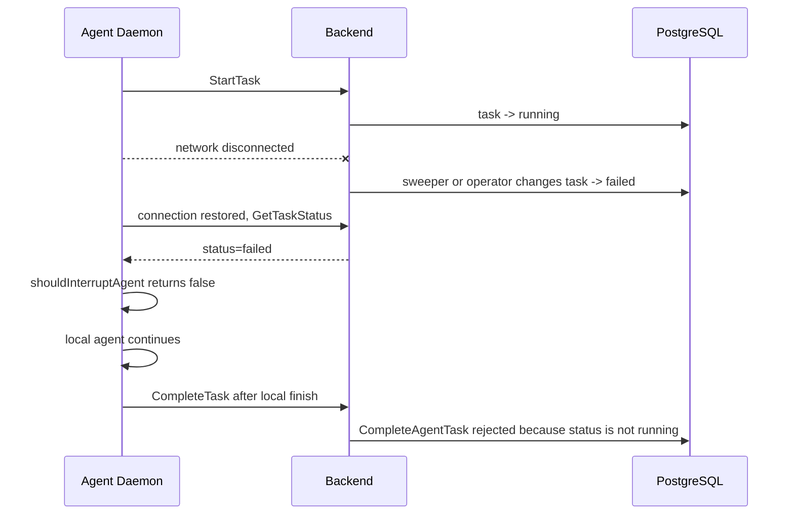

# 任务一 1.2 故障场景推演

本文分析三个场景，代码路径均基于当前仓库源码。

## 场景 A：Agent Daemon 崩溃时的任务泄漏

### 代码追踪路径

- `server/cmd/server/router.go:287`：Daemon API 路由组。
- `server/cmd/server/router.go:293`：HTTP heartbeat 入口 `POST /api/daemon/heartbeat`。
- `server/cmd/server/router.go:294`：WebSocket 入口 `GET /api/daemon/ws`。
- `server/internal/handler/daemon_ws.go:11`：`DaemonWebSocket` 校验 runtime 权限并交给 Hub。
- `server/internal/daemonws/hub.go:287`：`Hub.unregister` 只移除 WS 连接索引，不直接写 runtime 离线。
- `server/internal/handler/daemon.go:649`：`DaemonHeartbeat` 解析心跳并校验 runtime。
- `server/internal/handler/daemon.go:772`：`HandleDaemonWSHeartbeat` 是 WS 心跳对应入口。
- `server/internal/handler/daemon.go:808`：`recordHeartbeat` 写 Redis liveness 或调度 DB last_seen 更新。
- `server/internal/handler/daemon.go:612`：`runtimeLivenessTTL = 90s`。
- `server/internal/handler/daemon.go:626`：`runtimeHeartbeatDBFlushInterval = 60s`。
- `server/cmd/server/runtime_sweeper.go:18`：sweeper 周期 `30s`。
- `server/cmd/server/runtime_sweeper.go:30`：runtime stale 阈值 `150s`。
- `server/cmd/server/runtime_sweeper.go:72`：`runRuntimeSweeper` 周期执行 runtime 与 task 清扫。
- `server/cmd/server/runtime_sweeper.go:91`：`sweepStaleRuntimes` 标记 stale runtime。
- `server/cmd/server/runtime_sweeper.go:149`：offline runtime 下活动任务失败处理。
- `server/cmd/server/runtime_sweeper.go:237`：`sweepStaleTasks` 清理长时间卡住的任务。
- `server/pkg/db/queries/runtime.sql:116`：`SelectStaleOnlineRuntimes` 查询 stale online runtime。
- `server/pkg/db/queries/runtime.sql:125`：`MarkRuntimesOfflineByIDs` 将 runtime 改为 offline，并重新检查 stale 条件。
- `server/pkg/db/queries/runtime.sql:144`：`FailTasksForOfflineRuntimes` 将 offline runtime 下的活动任务改成 failed。
- `server/pkg/db/queries/agent.sql:446`：`RecoverOrphanedTasksForRuntime` 处理 daemon 重启后的遗留任务。
- `server/pkg/db/queries/agent.sql:462`：`FailStaleTasks` 处理 dispatched/running 超时。
- `server/internal/daemon/daemon.go:1207`：daemon 注册 runtime 后调用 `RecoverOrphans`。
- `server/internal/handler/task_lifecycle.go:24`：`RecoverOrphanedTasks` 入口。

### 状态图



### 事件时序



### 明确回答

后端通过 heartbeat 感知 Agent 离线。WebSocket 断开本身只清理连接索引；runtime 存活由 HTTP/WS heartbeat 维护，后端通过 Redis liveness 和 `agent_runtime.last_seen_at` 判断是否 stale。

正在执行的任务经历的主要状态为：

```text
queued -> dispatched -> running -> failed(runtime_offline | runtime_recovery | timeout) -> optional retry queued
```

正常代码路径下不存在任务永久卡在 `running` 的问题。依据如下：

- Daemon 被 kill 后不再发送 heartbeat，runtime 在超过 150 秒 stale 阈值后成为 sweeper 候选。
- sweeper 每 30 秒运行一次，所以 runtime 离线感知通常有约 180 秒上界。
- `FailTasksForOfflineRuntimes` 会把 offline runtime 下的 `dispatched`、`running`、`waiting_local_directory` 改为 `failed`，失败原因为 `runtime_offline`。
- 如果 runtime 仍被认为在线，`FailStaleTasks` 仍会把超过 9000 秒的 `running` 改为 `failed`，失败原因为 `timeout`。
- daemon 重启时会调用 `recover-orphans`，把旧进程遗留的活动任务改为 `failed(runtime_recovery)`，比等待 sweeper 更快。

边界条件：如果后端 sweeper 长期不运行、数据库不可写，或者人工写入异常数据，例如 `status='running'` 但 `started_at IS NULL`，现有机制无法提供恢复保证。这些不属于正常执行路径。

### 修复方案

当前场景不需要修复。现有机制由三层兜底：

- daemon 重启后的 `recover-orphans`
- runtime stale 后的 `FailTasksForOfflineRuntimes`
- task 超时后的 `FailStaleTasks`

## 场景 B：并发任务分配的竞态条件

### 代码追踪路径

- `server/cmd/server/router.go:297`：`POST /api/daemon/runtimes/{runtimeId}/tasks/claim`。
- `server/internal/handler/daemon.go:1057`：`ClaimTaskByRuntime`。
- `server/internal/handler/daemon.go:1091`：调用 `TaskService.ClaimTaskForRuntime`。
- `server/internal/service/task.go:934`：`ClaimTaskForRuntime`。
- `server/internal/service/task.go:970`：优先回收丢失响应的 stale dispatched task。
- `server/internal/service/task.go:1003`：按 runtime 查询 queued 候选。
- `server/pkg/db/queries/agent.sql:567`：`ListQueuedClaimCandidatesByRuntime`。
- `server/internal/service/task.go:1028`：按候选 task 的 agent 调用 `ClaimTask`。
- `server/internal/service/task.go:868`：`ClaimTask`。
- `server/internal/service/task.go:889`：统计 agent 维度活动任务数。
- `server/internal/service/task.go:902`：调用 `ClaimAgentTask`。
- `server/pkg/db/queries/agent.sql:266`：`ClaimAgentTask`。
- `server/pkg/db/queries/agent.sql:276`：单条 `UPDATE` 把 selected task 改为 `dispatched`。
- `server/pkg/db/queries/agent.sql:300`：子查询使用 `FOR UPDATE SKIP LOCKED`。

### 并发时序



### 明确回答

任务分配的并发控制机制是 PostgreSQL 行级锁和单语句原子更新。`ClaimAgentTask` 在 `UPDATE ... WHERE id = (SELECT ... FOR UPDATE SKIP LOCKED)` 中完成选择和状态更新，避免 Go 层先查后改。

在当前正常领取路径下，同一个 task 不会被两个 Agent 同时分配。依据如下：

- SQL 只选择 `status='queued'` 的 task。
- `FOR UPDATE SKIP LOCKED` 会跳过已被其他事务锁定的行。
- 第一个事务提交后，task 状态已变成 `dispatched`，第二个事务即使随后重新扫描，也不满足 `status='queued'`。

### 邻近风险

当前代码不会双分配同一个 task，但存在一个邻近一致性风险：`ClaimTaskForRuntime` 先按 `runtime_id` 列候选，随后调用只按 `agent_id` 领取的 `ClaimTask`。如果同一个 agent 在多个 runtime 上存在 queued task，runtime A 的 poller 理论上可能把 runtime B 的 task 改成 `dispatched`，随后因为 `task.RuntimeID != runtimeID` 不返回给 runtime A。这个问题不是双分配，但会造成错误 runtime 的 task 短暂卡在 `dispatched`，直到 `ReclaimStaleDispatchedTaskForRuntime` 或 sweeper 处理。

### 修复方案

核心思路：把领取 SQL 从“只按 agent”增强为“agent + runtime”，让数据库原子更新同时约束目标 runtime。

关键 diff：

```diff
diff --git a/server/pkg/db/queries/agent.sql b/server/pkg/db/queries/agent.sql
@@
--- name: ClaimAgentTask :one
+-- name: ClaimAgentTaskForRuntime :one
 UPDATE agent_task_queue
 SET status = 'dispatched', dispatched_at = now()
 WHERE id = (
     SELECT atq.id FROM agent_task_queue atq
-    WHERE atq.agent_id = $1 AND atq.status = 'queued'
+    WHERE atq.agent_id = @agent_id
+      AND atq.runtime_id = @runtime_id
+      AND atq.status = 'queued'
       AND NOT EXISTS (
           SELECT 1 FROM agent_task_queue active
           WHERE active.agent_id = atq.agent_id
@@
     LIMIT 1
     FOR UPDATE SKIP LOCKED
 )
 RETURNING *;
```

```diff
diff --git a/server/internal/service/task.go b/server/internal/service/task.go
@@
-task, err := s.Queries.ClaimAgentTask(ctx, agentID)
+task, err := s.Queries.ClaimAgentTaskForRuntime(ctx, db.ClaimAgentTaskForRuntimeParams{
+    AgentID:   agentID,
+    RuntimeID: runtimeID,
+})
```

测试设计：

- 并发唯一领取测试：创建一个 runtime、一个 agent、一个 queued task，启动 100 个 goroutine 同时调用 `ClaimTaskByRuntime`。断言只有一个响应包含该 task ID，其余为 `task: null`，数据库最终只有一条 `dispatched` 记录。
- 跨 runtime 防御测试：同一 agent 准备 runtime A 和 runtime B 的 queued task，runtime A 请求 claim 时断言不会把 runtime B 的 task 改成 `dispatched`。

## 场景 C：WebSocket 重连后的状态一致性

### 代码追踪路径

- `server/internal/daemon/daemon.go:581`：`Run` 启动 daemon。
- `server/internal/daemon/daemon.go:638`：创建 task wakeup channel。
- `server/internal/daemon/daemon.go:639`：启动 `taskWakeupLoop`。
- `server/internal/daemon/daemon.go:640`：启动 `heartbeatLoop`。
- `server/internal/daemon/daemon.go:646`：启动 `pollLoop`。
- `server/internal/daemon/wakeup.go:21`：`taskWakeupLoop`。
- `server/internal/daemon/wakeup.go:35`：调用 `runTaskWakeupConnection`。
- `server/internal/daemon/wakeup.go:43`：WS 不可用时 polling fallback 仍保留。
- `server/internal/daemon/wakeup.go:47`：带 jitter 的重连等待。
- `server/internal/daemon/wakeup.go:71`：创建 WS URL 并拨号。
- `server/internal/daemon/wakeup.go:97`：WS 断开后清理 WS heartbeat ack，使 HTTP heartbeat 恢复。
- `server/internal/daemon/wakeup.go:101`：连接成功后触发一次 `signalTaskWakeup`。
- `server/internal/daemon/wakeup.go:183`：WS heartbeat sender。
- `server/internal/daemon/wakeup.go:246`：`handleWSHeartbeatAck`。
- `server/internal/daemon/wakeup.go:258`：`readTaskWakeupMessages`。
- `server/internal/daemon/daemon.go:1923`：`runRuntimePoller` 持续 claim 和 dispatch。
- `server/internal/daemon/daemon.go:1987`：poller 调用 `ClaimTask`。
- `server/internal/daemon/daemon.go:2046`：`shouldInterruptAgent`。
- `server/internal/daemon/daemon.go:2073`：`watchTaskCancellation`。
- `server/internal/daemon/daemon.go:2174`：`handleTask` 使用 `watchTaskCancellation`。
- `server/internal/daemon/daemon.go:2220`：完成前最后一次状态检查。
- `server/internal/daemon/client.go:269`：`GetTaskStatus`。
- `server/internal/handler/daemon.go:1665`：`StartTask`。
- `server/internal/handler/daemon.go:1759`：`CompleteTask`。
- `server/pkg/db/queries/agent.sql:351`：`CompleteAgentTask` 只允许 `status='running'`。
- `server/pkg/db/queries/agent.sql:416`：`FailAgentTask` 只允许 active 状态。

### 重连时序



### 执行中任务取消时序



### 明确回答

重连机制是 `taskWakeupLoop` 中的循环拨号和指数退避。WS 断开不会停止 HTTP polling，连接不可用时日志明确说明 polling fallback 仍然有效。连接恢复后，daemon 立即触发一次 `signalTaskWakeup`，让 poller 尽快领取可能遗漏的任务。

对新任务领取而言，重连后状态是一致的。原因是 WS 只作为 best-effort wakeup，真正的任务领取仍走 HTTP claim；断连期间未收到的 wakeup 会通过 polling 补偿。

对正在执行的本地任务而言，取消可以被感知。`watchTaskCancellation` 每 5 秒调用 `GetTaskStatus`，当状态为 `cancelled` 或接口返回 404 时取消本地 `runCtx`。完成前还有一次 `GetTaskStatus` 检查，避免已经取消的任务被继续 complete。

存在的问题是：当前 `shouldInterruptAgent` 只把 `cancelled` 和 404 当作中断信号。如果断连期间后端把任务改成 `failed`、`completed` 或其他终态，本地 agent 不会立即中断，仍可能继续运行到结束。结束后 `CompleteAgentTask` 会因为状态不再是 `running` 而被拒绝，但本地算力已经浪费，并且日志表现为“本地完成、服务端拒绝终态写入”。

### 问题时序



### 修复方案

修复目标：

- 本地已经领取的 task 只要后端不再处于 active 状态，就立即中断本地 agent。
- WebSocket 重连后主动对账本地 active task，而不是完全等待下一次 5 秒轮询。

关键 diff：

```diff
diff --git a/server/internal/daemon/daemon.go b/server/internal/daemon/daemon.go
@@
 func shouldInterruptAgent(status string, err error) bool {
     if err != nil {
         return isTaskNotFoundError(err)
     }
-    return status == "cancelled"
+    switch status {
+    case "", "dispatched", "waiting_local_directory", "running":
+        return false
+    default:
+        return true
+    }
 }
```

```diff
diff --git a/server/internal/daemon/daemon.go b/server/internal/daemon/daemon.go
@@
     runCtx, runCancel := context.WithCancel(ctx)
     defer runCancel()
+    d.trackActiveTask(task.ID, runCancel)
+    defer d.untrackActiveTask(task.ID)
```

```diff
diff --git a/server/internal/daemon/wakeup.go b/server/internal/daemon/wakeup.go
@@
     d.logger.Info("task wakeup websocket connected", "runtimes", len(runtimeIDs))
     signalTaskWakeup(taskWakeups)
+    go d.reconcileActiveTasks(ctx)
```

测试设计：

- `shouldInterruptAgent` 单元测试：新增 `failed`、`completed`、`queued`、未知终态返回 true；保留 `running`、`dispatched`、`waiting_local_directory` 返回 false；保留瞬时 5xx 返回 false。
- `watchTaskCancellation` 测试：状态为 `failed` 时 channel 会关闭。
- `handleTask` 测试：runner 阻塞等待 `runCtx.Done()`，mock `/status` 返回 `failed`，断言 runner 被取消，且不会调用 `CompleteTask`。
- 重连对账测试：注册一个 active task cancel function，mock `GetTaskStatus` 返回 `failed`，调用 `reconcileActiveTasks` 后断言 cancel function 被调用。
