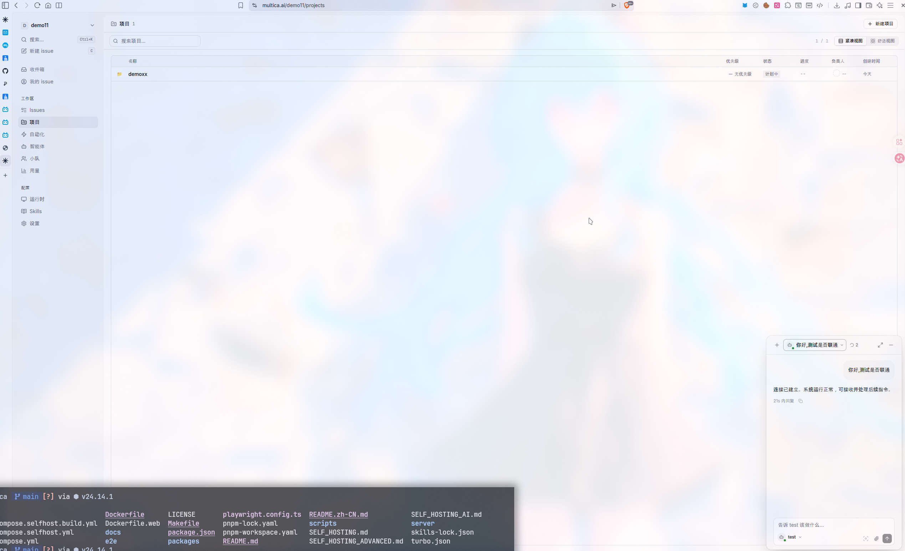

# 任务一 1.1 本地搭建记录

## 基本信息

- 项目目录：`/home/snemc/workspace/writeen_exam/test1/multica`
- 部署方式：Docker Compose 自部署
- 前端地址：`http://localhost:3000`
- 后端地址：`http://localhost:8080`
- 数据库镜像：`pgvector/pgvector:pg17`
- 记录日期：2026-06-03

## 搭建过程

### 1. 确认 Docker Compose 可用

```bash
docker compose version
```

实际环境中 Docker Compose 版本为 `5.1.4`。

### 2. 启动自部署服务

在项目根目录执行：

```bash
make selfhost
```

该命令完成以下动作：

- 从 `.env.example` 创建 `.env`
- 生成随机 `JWT_SECRET`
- 下载前端、后端和 PostgreSQL 镜像
- 启动 PostgreSQL、后端服务和前端服务

服务启动完成后控制台输出：

```text
Frontend: http://localhost:3000
Backend:  http://localhost:8080
```

### 3. 配置 SMTP 邮件服务

首次启动时，后端提示未配置邮件服务，验证码只能输出到后端日志。为测试真实邮件发送，在 `.env` 中配置 SMTP：

```env
RESEND_API_KEY=
RESEND_FROM_EMAIL=snemc@linux.do
SMTP_HOST=mail.linux.do
SMTP_PORT=465
SMTP_USERNAME=snemc@linux.do
SMTP_TLS_INSECURE=false
SMTP_TLS=implicit
```

说明：`.env` 中包含 `SMTP_PASSWORD`，本文档不记录明文密码。

修改 `.env` 后重启服务：

```bash
docker compose -f docker-compose.selfhost.yml up -d --force-recreate
```

后端日志显示 SMTP 已启用：

```text
EmailService: SMTP relay mail.linux.do:465 (implicit-tls) from=snemc@linux.do
```

## 遇到的问题和解决方案

### 问题 1：`pgvector/pgvector:pg17` 镜像下载中断重试

现象：执行 `make selfhost` 时，前端和后端镜像已下载完成，但 Compose 长时间没有创建容器。排查后发现卡在 `pgvector/pgvector:pg17` 的部分镜像层下载，日志中出现重试。

处理方式：

```bash
docker pull pgvector/pgvector:pg17
```

结果：镜像下载完成后，原 `make selfhost` 进程继续执行并成功创建容器。

### 问题 2：首次启动没有邮件后端

现象：后端日志提示未配置 `RESEND_API_KEY` 或 `SMTP_HOST`，验证码只能输出到后端日志。

处理方式：在 `.env` 中配置 SMTP 465 隐式 TLS，并重启 Compose 服务。

结果：后端启动日志显示 SMTP relay 已启用，登录验证码接口可以正常发送邮件。

## 运行验证

### 1. 容器状态

```bash
docker compose -f docker-compose.selfhost.yml ps
```

验证结果：

```text
multica-postgres-1   Up, healthy
multica-backend-1    Up, 127.0.0.1:8080->8080/tcp
multica-frontend-1   Up, 127.0.0.1:3000->3000/tcp
```

### 2. 后端健康检查

```bash
curl http://localhost:8080/health
```

验证结果：

```json
{"status":"ok"}
```

### 3. 前端访问检查

```bash
curl -I http://localhost:3000
```

验证结果：HTTP 状态码为 `200 OK`。

### 4. 邮件验证码发送测试

```bash
curl -sS -i -X POST http://localhost:8080/auth/send-code \
  -H 'Content-Type: application/json' \
  --data '{"email":"snemc@linux.do"}'
```

验证结果：

```json
{"message":"Verification code sent"}
```

## 运行成功截图

运行截图位于：

```text
assets/image-20260603163747961.png
```


