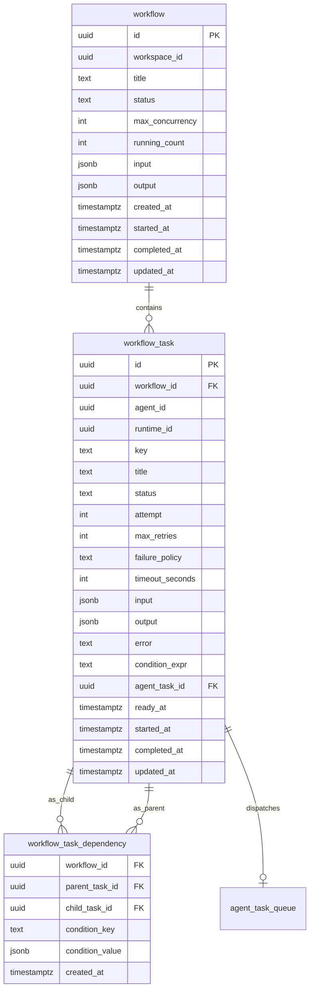
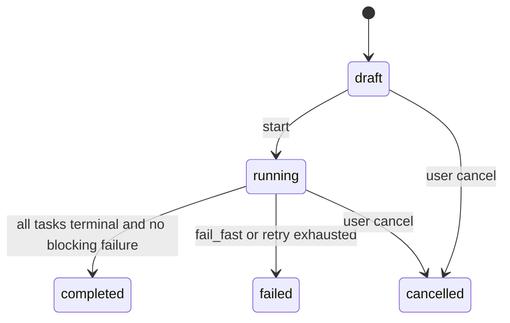
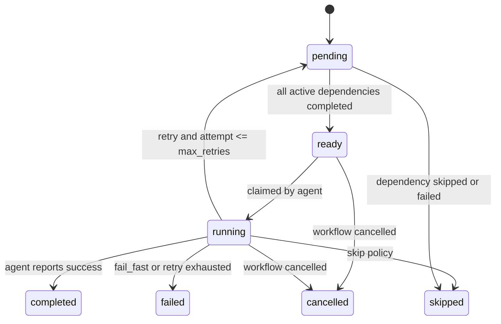

# 任务二：多 Agent 任务编排引擎设计文档

## 目标与边界

目标是在现有 Agent task queue 之上增加 Workflow 编排层，支持 DAG 依赖、并行执行、并发限制、失败策略、条件分支、超时和崩溃恢复。

核心原则：

- Workflow 负责“哪些任务现在可以运行”。
- Agent task queue 负责“某个 runnable task 由哪个 runtime 执行”。
- 状态变更必须由数据库事务保护，避免多个 Agent 同时领取同一编排任务。

## 数据模型

### ER 图



### 表结构

```sql
CREATE TABLE workflow (
    id uuid PRIMARY KEY DEFAULT gen_random_uuid(),
    workspace_id uuid NOT NULL REFERENCES workspace(id),
    title text NOT NULL,
    status text NOT NULL CHECK (status IN (
        'draft', 'running', 'completed', 'failed', 'cancelled'
    )),
    max_concurrency integer NOT NULL CHECK (max_concurrency > 0),
    running_count integer NOT NULL DEFAULT 0 CHECK (running_count >= 0),
    input jsonb NOT NULL DEFAULT '{}',
    output jsonb,
    created_at timestamptz NOT NULL DEFAULT now(),
    started_at timestamptz,
    completed_at timestamptz,
    updated_at timestamptz NOT NULL DEFAULT now()
);

CREATE TABLE workflow_task (
    id uuid PRIMARY KEY DEFAULT gen_random_uuid(),
    workflow_id uuid NOT NULL REFERENCES workflow(id) ON DELETE CASCADE,
    agent_id uuid NOT NULL REFERENCES agent(id),
    runtime_id uuid REFERENCES agent_runtime(id),
    key text NOT NULL,
    title text NOT NULL,
    status text NOT NULL CHECK (status IN (
        'pending', 'ready', 'running', 'completed', 'failed', 'skipped', 'cancelled'
    )),
    attempt integer NOT NULL DEFAULT 0,
    max_retries integer NOT NULL DEFAULT 0,
    failure_policy text NOT NULL CHECK (failure_policy IN ('fail_fast', 'retry', 'skip')),
    timeout_seconds integer,
    input jsonb NOT NULL DEFAULT '{}',
    output jsonb,
    error text,
    condition_expr text,
    agent_task_id uuid REFERENCES agent_task_queue(id),
    ready_at timestamptz,
    started_at timestamptz,
    completed_at timestamptz,
    updated_at timestamptz NOT NULL DEFAULT now(),
    UNIQUE (workflow_id, key)
);

CREATE TABLE workflow_task_dependency (
    workflow_id uuid NOT NULL REFERENCES workflow(id) ON DELETE CASCADE,
    parent_task_id uuid NOT NULL REFERENCES workflow_task(id) ON DELETE CASCADE,
    child_task_id uuid NOT NULL REFERENCES workflow_task(id) ON DELETE CASCADE,
    condition_key text,
    condition_value jsonb,
    created_at timestamptz NOT NULL DEFAULT now(),
    PRIMARY KEY (parent_task_id, child_task_id),
    CHECK (parent_task_id <> child_task_id)
);

CREATE INDEX idx_workflow_task_ready
    ON workflow_task (workflow_id, ready_at, id)
    WHERE status = 'ready';

CREATE INDEX idx_workflow_task_running_timeout
    ON workflow_task (workflow_id, started_at)
    WHERE status = 'running';

CREATE INDEX idx_workflow_dep_child ON workflow_task_dependency(child_task_id);
CREATE INDEX idx_workflow_dep_parent ON workflow_task_dependency(parent_task_id);
```

字段说明：

- `workflow.status`：编排整体状态。
- `workflow.max_concurrency`：编排内最多同时执行的任务数。
- `workflow.running_count`：冗余计数，用事务更新减少每次 claim 的聚合成本。
- `workflow_task.status`：编排任务自身状态，不等同于底层 `agent_task_queue.status`。
- `workflow_task.attempt`：已实际启动次数。
- `workflow_task.failure_policy`：失败策略。
- `workflow_task.timeout_seconds`：任务级超时配置。
- `workflow_task.agent_task_id`：当前尝试对应的底层 agent task。重试时可创建新的 agent task，并更新该字段。
- `workflow_task_dependency.condition_key` 与 `condition_value`：条件分支使用，父任务输出满足条件时依赖边生效。

## 状态机

### Workflow 状态



转换条件：

- `draft -> running`：DAG 校验通过，无环，至少一个任务。
- `running -> completed`：所有 task 进入 `completed`、`skipped` 或 `cancelled`，且没有触发 fail_fast。
- `running -> failed`：任一 task 触发 `fail_fast`，或 `retry` 超过最大次数后升级为 fail_fast。
- `running -> cancelled`：用户主动取消，或上游 issue/workspace 被取消。

### Task 状态



状态说明：

- `pending`：依赖未满足。
- `ready`：所有生效前置依赖已完成，可被 Agent 领取。
- `running`：已经分配给 Agent 执行。
- `completed`：任务成功完成。
- `failed`：任务失败且不再重试。
- `skipped`：任务失败后执行 skip 策略，或因依赖被跳过而无法执行。
- `cancelled`：被 workflow 或用户取消。

## 核心算法

### DAG 存储和查询

使用邻接表存储 DAG：

- `workflow_task` 存储节点。
- `workflow_task_dependency` 存储边，方向为 `parent_task_id -> child_task_id`。

常用查询：

- 查某任务前置依赖：按 `child_task_id` 查询依赖边。
- 查某任务后续任务：按 `parent_task_id` 查询依赖边。
- 查可执行任务：查询 `status='ready'` 的任务，并通过 claim 事务改为 `running`。

### 判断依赖是否全部完成

基础算法：

```text
for each pending task:
    deps = list dependencies where child_task_id = task.id and condition is active
    if any dep task status in failed/skipped/cancelled:
        mark task skipped
    else if all dep task status == completed:
        mark task ready
```

生产实现不建议每次全图扫描。更好的方式是维护依赖完成计数：

- `dependency_count`：生效前置依赖总数。
- `completed_dependency_count`：已完成前置依赖数。
- 父任务完成时，只更新其直接子任务的 `completed_dependency_count`。
- 当 `completed_dependency_count = dependency_count` 时，将子任务从 `pending` 改为 `ready`。

条件分支下，父任务完成后先评估条件边：

- 条件满足的边计入 child 的生效依赖。
- 条件不满足的 child 如果没有其他入边满足，则标记为 `skipped`。
- 多条件汇聚时，只有所有生效依赖完成后才进入 `ready`。

### 循环依赖检测

创建或更新 DAG 时使用 Kahn 拓扑排序：

```text
in_degree = each node dependency count
queue = all nodes where in_degree == 0
visited = 0

while queue not empty:
    node = pop queue
    visited += 1
    for child in outgoing[node]:
        in_degree[child] -= 1
        if in_degree[child] == 0:
            push child

if visited != node_count:
    graph has cycle
```

小图也可以使用 DFS 三色标记。任务二代码实现采用 DFS，适合内存版核心逻辑。

## API 设计

### 创建编排

```http
POST /api/workflows
Content-Type: application/json
```

```json
{
  "title": "release workflow",
  "max_concurrency": 3,
  "tasks": [
    {
      "key": "plan",
      "title": "Plan implementation",
      "agent_id": "00000000-0000-0000-0000-000000000001",
      "failure_policy": "retry",
      "max_retries": 2,
      "timeout_seconds": 1800,
      "input": {}
    }
  ],
  "dependencies": [
    {
      "parent": "plan",
      "child": "implement"
    }
  ]
}
```

响应：

```json
{
  "id": "workflow-id",
  "status": "draft"
}
```

### 启动编排

```http
POST /api/workflows/{workflowId}/start
```

动作：

- 校验 DAG 无环。
- 计算初始 ready task。
- 将 workflow 状态改为 `running`。
- 对 ready task 触发 daemon wakeup。

### 查询状态

```http
GET /api/workflows/{workflowId}
```

返回 workflow、task 列表、依赖边、运行计数和失败摘要。

### 取消编排

```http
POST /api/workflows/{workflowId}/cancel
```

动作：

- 将 workflow 改为 `cancelled`。
- 将 `pending`、`ready`、`running` task 改为 `cancelled`。
- 对已创建的底层 `agent_task_queue` 调用取消逻辑。

### Agent 领取编排任务

```http
POST /api/daemon/runtimes/{runtimeId}/workflow-tasks/claim
```

动作：

- 在事务内锁定 workflow row。
- 检查 `running_count < max_concurrency`。
- 使用 `FOR UPDATE SKIP LOCKED` 选择一个 `ready` task。
- 将 task 改为 `running`，`attempt += 1`，`running_count += 1`。
- 创建或关联底层 `agent_task_queue` 任务。

### 回报任务结果

```http
POST /api/daemon/workflow-tasks/{taskId}/complete
POST /api/daemon/workflow-tasks/{taskId}/fail
```

动作：

- 在事务内更新 task 终态。
- `running_count -= 1`。
- 根据失败策略更新 workflow 或子任务。
- 对新 ready task 触发 daemon wakeup。

## 并发与一致性

### 多个 Agent 同时领取

领取事务伪代码：

```sql
BEGIN;

SELECT * FROM workflow
WHERE id = $workflow_id AND status = 'running'
FOR UPDATE;

-- running_count 在 workflow 行锁保护下读取。
-- 如果已达到上限，直接提交并返回空任务。

WITH candidate AS (
    SELECT id
    FROM workflow_task
    WHERE workflow_id = $workflow_id
      AND status = 'ready'
      AND runtime_id = $runtime_id
    ORDER BY ready_at ASC, id ASC
    LIMIT 1
    FOR UPDATE SKIP LOCKED
)
UPDATE workflow_task
SET status = 'running',
    attempt = attempt + 1,
    started_at = now(),
    updated_at = now()
WHERE id = (SELECT id FROM candidate)
RETURNING *;

UPDATE workflow
SET running_count = running_count + 1,
    updated_at = now()
WHERE id = $workflow_id;

COMMIT;
```

关键点：

- `workflow FOR UPDATE` 保护 `running_count`，避免并发领取突破 max_concurrency。
- `workflow_task FOR UPDATE SKIP LOCKED` 保护具体任务，避免同一任务被多个 Agent 领取。
- 状态更新和计数更新在同一事务内完成。

### 任务状态变更原子性

完成事务需要同时处理：

- task `running -> completed`
- workflow `running_count -= 1`
- 直接子任务的依赖完成计数更新
- 子任务 `pending -> ready`
- workflow 是否完成
- 事件写入 outbox

建议使用事务内 outbox：

```text
业务表更新成功 -> 写 workflow_event_outbox -> commit -> 异步投递 WS/Redis
```

这样可以避免“数据库回滚但事件已发送”的不一致。

### 超时机制

后台 sweeper 周期扫描：

```sql
SELECT *
FROM workflow_task
WHERE status = 'running'
  AND timeout_seconds IS NOT NULL
  AND started_at < now() - make_interval(secs => timeout_seconds)
FOR UPDATE SKIP LOCKED;
```

每个超时 task 走与 `fail` 相同的失败策略处理路径，错误原因为 `timeout`。

### 崩溃恢复

服务重启后恢复策略：

- Workflow 和 task 状态均存储在 PostgreSQL。
- `ready` task 可直接被重新 claim。
- `running` task 需要租约字段，例如 `lease_expires_at` 或绑定 runtime heartbeat。
- 重启后 sweeper 扫描过期 lease，将其按失败策略处理。
- outbox 未投递事件可继续投递，保证通知最终一致。

## Trade-off 分析

### 取舍 1：邻接表而不是 JSON DAG

选择邻接表。原因是依赖查询、子任务推进、环检测和局部更新都需要数据库可索引结构。JSON DAG 写入简单，但每次调度需要解析整图，难以用事务精准锁定局部节点。

代价是表数量增加，创建 workflow 时需要写多行数据。这个代价可接受，因为调度读写频率高于创建频率。

### 取舍 2：维护 `running_count` 而不是每次 count

选择维护冗余 `running_count`。原因是 claim 是热路径，每次 `count(*) where status='running'` 在高并发下会增加数据库压力。

代价是需要保证计数更新与 task 状态变更同事务提交。只要所有状态转移入口收敛到同一服务层，并对 workflow 行加锁，计数一致性可以保证。

### 取舍 3：skip 使用 `skipped` 终态而不是 `failed`

选择将 skip 策略下的任务标记为 `skipped`。原因是 workflow 最终状态需要区分“编排失败”和“非关键任务跳过”。如果标为 `failed`，汇总状态会混淆 fail_fast 和 skip。

代价是统计失败率时需要同时查看 `error` 和 `skipped` 原因，而不是只看 `failed`。

## 核心实现说明

核心实现位于 `task2/src/`：

- `workflow_engine.py`：内存版引擎。
- `test_workflow_engine.py`：测试用例。

该实现覆盖：

- DAG 构建和依赖添加。
- DFS 环检测。
- `pending -> ready -> running -> completed/failed/skipped/cancelled` 状态机。
- `fail_fast`、`retry`、`skip` 三种失败策略。
- `max_concurrency` 并发限制。

运行命令：

```bash
python3 -m unittest discover -s submission/task2/src -p 'test_*.py'
```
